# GrokBot for X — Reply Follow-up Spec

Status: Draft
Owner: Kevin Kaminski (@kkaminsk)
Last updated: 2026-09-30 (rev 7)

## 1. Overview and Goals

GrokBot watches the replies to and quote posts of Kevin's recent posts on X, decides which ones are worth a personal follow-up, and emails a digest with a short explanation and a Grok-drafted suggested reply for each one.

### Pipeline

```mermaid
flowchart LR
    Routine["Grok Bot routine"] --> Posts["Fetch my recent posts"]
    Posts --> Search["One search: new replies and quote posts"]
    Search --> Dedupe["Skip already-seen replies"]
    Dedupe --> BotFilter["Bot filter"]
    BotFilter --> Weights["Rule-based weight"]
    Weights --> Grok["Grok: classify, urgency, draft"]
    Grok --> Rank["Final score and surfacing rules"]
    Rank --> Email["Gmail SMTP digest"]
    Email --> Mark["Mark items notified"]
```



### Goals

- Surface the handful of replies that actually deserve attention, instead of reading every reply.
- Explain *why* each reply was flagged.
- Provide a ready-to-edit suggested reply in Kevin's voice.
- Run unattended on a schedule as a custom GrokBot application, with bounded API usage per run. (Kevin manages the X API budget himself; the bot only reports usage.)

### Non-goals

- The bot never posts, replies, likes, reposts, follows, or sends DMs. It is read-only on X.
- No web dashboard or chat integrations (email only for v1).
- No analysis of mentions that are not replies to or quote posts of Kevin's posts.
- No analysis of replies underneath other people's quote posts.
- No analysis of side conversations inside Kevin's threads (replies to other repliers).

### Known Limitations (accepted)

- **Already-answered replies are not detected.** The bot does not check whether Kevin has already responded. A reply he answered before the digest arrived can still appear in it.
- **Engagement is measured once.** A reply's likes, replies, and reposts are recorded when the bot first sees it and are never re-checked. The high-engagement signal therefore mostly fires for replies that are already a few hours old when a run picks them up.

## 2. User Stories

- As Kevin, I get an email at 8:00 and 17:00 listing the 5–10 replies most worth answering, so I can respond without scrolling through every thread.
- As Kevin, I see why each reply was flagged (for example "Verified account, 48k followers, asking about a partnership"), so I can trust the ranking.
- As Kevin, I get a suggested reply under 280 characters that I can copy, edit, and post myself.
- As Kevin, I never see the same reply in two digests.
- As Kevin, I get no email when nothing needs my attention.
- As Kevin, I get a short failure email if a scheduled run crashes, so I know the bot is not silently broken.
- As Kevin, I can add handles to a VIP list so technical questions from those people are always surfaced.
- As Kevin, I only see questions that are on topic for my post or my areas of expertise, not random off-topic asks.
- As Kevin, I see notable quote posts of my posts alongside replies, clearly labeled, so I don't miss commentary that happens outside my threads.

## 3. X API Integration

Access: X API pay-per-use (or higher tier). All calls use an app-only OAuth 2.0 Bearer token (`X_BEARER_TOKEN`); no user-context write scopes are required.

### 3.1 Endpoints

| Purpose | Endpoint | Key parameters |
|---|---|---|
| Resolve my user ID (once, if `X_USER_ID` unset) | `GET /2/users/by/username/:username` | `X_USERNAME` |
| My recent posts | `GET /2/users/:id/tweets` | `exclude=replies,retweets`, `start_time=now-LOOKBACK_DAYS`, `max_results`, `tweet.fields=conversation_id,created_at,public_metrics` |
| All new replies and quote posts (one call per run) | `GET /2/tweets/search/recent` | `query=((to:<my_username> is:reply) OR quotes_of_tweet_id:<id1> OR quotes_of_tweet_id:<id2> ...) -from:<my_username>`, `since_id=<global cursor>`, `max_results=100` (paginated up to `MAX_RESULTS`), `tweet.fields=author_id,conversation_id,in_reply_to_user_id,referenced_tweets,created_at,public_metrics`, `expansions=author_id`, `user.fields=username,name,public_metrics,verified,verified_type,description,created_at,profile_image_url` |
| Accounts I follow (cached daily) | `GET /2/users/:id/following` | `max_results=1000`, paginated |

### 3.2 Constraints

- `search/recent` only covers the last 7 days, so `LOOKBACK_DAYS` is capped at 7.
- A single search per run covers everything. `to:<my_username>` matches direct replies to Kevin, and the `quotes_of_tweet_id:` terms are built from the recent posts returned by `GET /2/users/:id/tweets` (up to `MAX_POSTS`).
- Each result is matched to Kevin's post by `conversation_id` (replies) or by the quoted post ID (quote posts). Replies to Kevin in conversations he didn't start are still included and shown without an original-post snippet.
- Side conversations inside Kevin's threads (replies to other repliers) are out of scope, since covering them would need one search per post.
- If the query exceeds the plan's maximum query length, the `quotes_of_tweet_id:` terms are split across additional calls that share the same cursor. The limit is set by `X_MAX_QUERY_LENGTH` (default 512).
- Each result is tagged with a `kind`: `quote` when `referenced_tweets` contains `type=quoted` pointing at Kevin's post, otherwise `reply`. Set `INCLUDE_QUOTES=false` to leave out the quote terms.
- If a post is both a reply in Kevin's thread and a quote of his post, it is treated as a `reply`.
- The VIP list is a plain text file (`vip.txt`, one handle per line, gitignored) merged with the cached following list.

### 3.3 Usage Limits

Kevin manages the X API budget directly in the X developer console. The bot does not estimate or enforce spend; it only keeps per-run usage bounded and visible:

- A single global `since_id` cursor is stored in the `state` table so each run only fetches new replies and quote posts. A quiet run costs two calls: recent posts and one search.
- `MAX_POSTS` caps how many recent posts are included as quote terms (default 20).
- `MAX_RESULTS` caps total results (replies plus quote posts) fetched per run (default 300). If the cap is hit, the cursor advances only to the newest result actually processed, so nothing is skipped and the rest is picked up next run.
- The following list is refreshed at most once every 24 hours. Kevin follows several hundred accounts, so this is one call per day.
- Each run records the number of X calls and returned objects in the `runs` table and the digest footer.

## 4. Follow-up Criteria and Scoring

Replies and quote posts are scored the same way. In this section, "reply" means either. Each new reply goes through four steps, in this order:

1. **Bot filter** (section 4.1): drop likely bots locally. No API cost.
2. **Rule-based weight** (section 4.2): score who the author is and how much engagement the reply has. No API cost.
3. **Grok classification** (section 4.3): classify the content, rate urgency, and draft a reply.
4. **Final score** (section 4.4): combine the weight and urgency, then apply the surfacing rules.

### 4.1 Bot and Spam Filter

Kevin's X audience includes a large share of bot accounts, so likely bots are dropped locally **before** scoring and before any Grok call. This costs nothing extra because all the signals come from fields already returned by the search call.

Each author gets a bot score from these signals:

| Signal | Rule | Points |
|---|---|---|
| New account | `created_at` newer than `BOT_MIN_ACCOUNT_AGE_DAYS` (30) | 2 |
| Default avatar | `profile_image_url` contains `default_profile` | 1 |
| Generated-looking handle | 6 or more trailing digits, for example `@crypto_king48213907` | 1 |
| Lopsided follow ratio | `following_count > 10 * followers_count` and `followers_count < 100` | 1 |
| Empty profile | blank `description` | 1 |
| Spam text | matches patterns in `spam_patterns.txt` (for example "DM me", wallet addresses, "airdrop", "giveaway", "check my bio", unrelated links) | 2 |
| Duplicate text | the same reply text, ignoring case and whitespace, posted by 3 or more different accounts in this run | 2 |

- A reply is dropped when the bot score is at least `BOT_SCORE_MAX` (default 3).
- Authors who are followed, VIP, or a verified organization (`verified_type` of `business` or `government`) are **never** filtered. A paid blue checkmark gives no bypass.
- Dropped replies are saved in `replies` with `category = bot_filtered` so they are not re-evaluated. They are not sent to Grok and not shown in the digest.
- The count of filtered replies appears in the digest footer and in `runs.bots_filtered`.
- `BOT_FILTER=false` disables the filter.
- `spam_patterns.txt` is committed with sensible defaults and can be edited.

### 4.2 Rule-based Weight

These signals describe the author and the reply's engagement. They are computed locally, and the weights can be changed in config:

| Signal | Source | Rule | Weight env var | Default |
|---|---|---|---|---|
| Influential author | X user `public_metrics` | `followers_count >= INFLUENCER_MIN_FOLLOWERS` (5,000) | `W_INFLUENTIAL` | 2 |
| Verified organization | X user `verified_type` | `business` or `government` (a paid blue checkmark does not count) | `W_VERIFIED` | 1 |
| Followed author | following cache | author in set | `W_FOLLOWED` | 2 |
| VIP author | `vip.txt` | author in set | `W_VIP` | 4 |
| High engagement | reply `public_metrics` | `like_count + reply_count + retweet_count >= ENGAGEMENT_MIN` (10), measured once (section 1) | `W_ENGAGEMENT` | 2 |

`rule_weight` is the sum of the weights for the signals that fired.

### 4.3 Grok Classification

Every reply that passes the bot filter and has not been seen before is sent to Grok, which returns JSON matching this schema:

```json
{
  "reply_id": "string",
  "kind": "reply | quote",
  "category": "opportunity | question | criticism | misinformation | positive | none",
  "urgency": 1,
  "reason": "One sentence on why Kevin should (or need not) respond.",
  "suggested_reply": "At most 280 characters, in Kevin's voice. Empty when category is positive or none."
}
```

- Categories describe the **content** only. Who the author is (VIP, followed, influential) is handled by the rule-based weights, so Grok never needs to know Kevin's VIP list.
  - `opportunity`: business, collaboration, speaking, or hiring interest.
  - `question`: a genuine technical question that is **on topic**, meaning it relates to the original post or to Kevin's areas of expertise (Windows 365, Intune, Azure, MSIX/App-V, Microsoft 365 Copilot, agentic AI, OpenClaw, MCP). Off-topic questions are `none`.
  - `criticism`: disagreement or a complaint about Kevin's post or work.
  - `misinformation`: a factually wrong claim about the topic that could mislead readers.
  - `positive`: praise, thanks, or agreement with nothing to answer ("great post!").
  - `none`: everything else, including off-topic questions.
- `urgency` is an integer from 1 (can ignore) to 5 (respond today).
- Grok receives the original post text, the reply text, the author's handle, bio, and follower count, and the rule-based signals that fired, so it can explain its reasoning.
- For quote posts, Grok is told the text is commentary shared with the author's own followers rather than a message addressed to Kevin. The suggested reply is written as a reply under the quote post, and for criticism Grok may suggest "no response needed" by setting a low urgency.

### 4.4 Final Score and Surfacing Rules

```
score = rule_weight + urgency
```

- A reply enters the digest when `score >= SCORE_THRESHOLD` (default 5), **or** it is a `question` from a VIP (always surfaced), **or** `category` is `misinformation` with `urgency >= 3`.
- Replies with `category` of `positive` or `none` are never surfaced, regardless of author or score. Pleasantries need no follow-up, including from VIPs.
- The digest is capped at `DIGEST_MAX_ITEMS` (default 10), highest score first.

## 5. Grok Usage

- Grok is called through the existing OpenAI-compatible client (`create_client()` in `src/bot.py`) against `GROK_BASE_URL` with model `GROK_MODEL`.
- Default model: `grok-4.3`. It is xAI's flagship for low hallucination and tool use, supports strict `json_schema` structured output, and costs $1.25 per million input tokens and $2.50 per million output tokens, less than `grok-4.6`. A typical run of 10 to 30 replies uses well under 50,000 tokens.
- Requests use structured output (`response_format` with a JSON schema) so the response parses without guesswork. Responses that fail validation are retried once and then skipped and logged.
- Replies are batched (`GROK_BATCH_SIZE`, default 10) into a single request that returns an array of results, to reduce cost and latency.
- The system prompt includes:
  - Kevin's voice description, loaded from `voice.md` (committed in the repo root; built from Kevin's public posts and profile).
  - The category definitions and scoring guidance from section 4.
  - Rules for drafts:
    - Written in English, in a **formal**, professional register: complete sentences, no slang, no emoji.
    - **Never patronizing.** Treat the person as a peer. No "Great question!", no flattery, no explaining basics they clearly already know, no condescending corrections.
    - For technical questions, answer the question directly and concisely, adding one supporting detail or reference if useful.
    - At most 280 characters, no hashtags unless the reply used them, no promises of meetings or money.
    - Courteous toward criticism. Corrections state the fact plainly without being combative.
- Reply text is treated as untrusted input. It is wrapped in clear delimiters, and the prompt instructs Grok to ignore any instructions inside it.

## 6. State

SQLite database at `data/grokbot.db` (the `data/` directory is gitignored).

| Table | Columns |
|---|---|
| `state` | `key` (PK), `value` (holds `search_since_id` and `following_refreshed_at`) |
| `posts` | `id` (PK), `created_at`, `text` |
| `replies` | `id` (PK), `post_id`, `kind` (`reply` or `quote`), `author_id`, `author_username`, `text`, `created_at`, `rule_weight`, `category`, `urgency`, `score`, `reason`, `suggested_reply`, `notified_at` (nullable) |
| `following_cache` | `user_id` (PK), `username`, `refreshed_at` |
| `runs` | `id` (PK), `started_at`, `finished_at`, `status`, `x_calls`, `x_objects`, `bots_filtered`, `grok_calls`, `error` |

- A reply already present in `replies` is never re-sent to Grok.
- `notified_at` is set only after the email is sent successfully, so a failed send is retried on the next run.
- Rows older than `RETENTION_DAYS` (default 30) are purged at the start of each run.

## 7. Email Digest

### 7.1 Transport

The digest is sent from Kevin's personal Gmail account over SMTP with STARTTLS, configured by `SMTP_HOST`, `SMTP_PORT`, `SMTP_USER`, `SMTP_PASSWORD`, `DIGEST_FROM`, and `DIGEST_TO`.

- Host `smtp.gmail.com`, port 587, STARTTLS.
- `SMTP_USER` and `DIGEST_FROM` are the Gmail address.
- `SMTP_PASSWORD` is a Gmail **App Password** (16 characters), not the normal account password. It requires 2-Step Verification on the Google account and is created at https://myaccount.google.com/apppasswords. It can be revoked there at any time without affecting the main password.
- `DIGEST_TO=kevin.kaminski@bighatgroup.com`.
- Gmail limits personal accounts to roughly 500 recipients per day, far above this bot's two emails per day.
- The first digests may land in the bighatgroup.com spam folder. Add the Gmail address as a safe sender there.

### 7.2 Content

- Subject: `GrokBot: 4 replies and 1 quote post to follow up on (Sep 30, 08:00)`.
- The email is multipart, with HTML and plain-text bodies.
- Items are grouped in this order: VIP questions, Opportunity, Question, Misinformation, Criticism.
- Each item shows:
  - A `Reply` or `Quote post` label.
  - The author's display name, @handle, follower count, and a verified marker.
  - The reply or quote text and a link to `https://x.com/<handle>/status/<reply_id>`.
  - A snippet of the original post.
  - The reason it was flagged, plus the score and signals that fired.
  - The suggested reply, in a copyable block.
- The footer shows run statistics: posts scanned, replies and quote posts seen, items flagged, and X API calls made.

### 7.3 Behavior

- If nothing is flagged, no email is sent unless `SEND_EMPTY_DIGEST=true`.
- If a run crashes, a short failure email with the error summary is sent to `DIGEST_TO`. Failure emails are limited to one per 6 hours.
- `--dry-run` prints the digest to stdout instead of sending it and does not set `notified_at`.

## 8. Runtime and Scheduling

GrokBot is developed in WSL but **runs as a Bot in the Grok Bot app** (section 8.1), not in WSL. The code must therefore not depend on the development machine:

- **Entry point:** `python -m src.digest` performs exactly one run and exits (flags: `--dry-run`, `--verbose`). The host's scheduler triggers it at 08:00 and 17:00 in `DIGEST_TIMEZONE` (default `America/Edmonton`).
- **Paths:** the SQLite file and lock file live under `DATA_DIR` (default `./data`). Logs go to stdout so the host can collect them.
- **Secrets:** read from environment variables. A `.env` file is used only for local development.
- **Overlap:** a lock file in `DATA_DIR` (`fcntl.flock`) prevents two runs from overlapping. If the lock is held, the new run exits immediately with a log line.
- **Missed runs:** need no special handling. The global cursor catches up on the next run, as long as the gap is under 7 days.

### 8.1 Hosting on Grok Bot

GrokBot runs as a dedicated Bot in the Grok Bot app ("X Reply Scout"). The Bot owns scheduling, storage, and secrets. The Python script does all the fetching, scoring, Grok calls, and email, so behavior stays deterministic and testable.

| Concern | How it is handled |
|---|---|
| Code location | Cloned to `/workspace/GrokBotDemo` on the Bot's persistent cloud computer. `/workspace` survives computer updates and recovery. |
| Persistent state | `DATA_DIR=/workspace/GrokBotDemo/data`, so the SQLite cursor, dedupe, and following cache persist between runs. |
| Dependencies | Installed into `/workspace/GrokBotDemo/.venv`. Each routine run recreates the venv if a computer Reset removed it. |
| Secrets | Stored in the Bot's **Secrets** section as environment variables: `X_BEARER_TOKEN`, `GROK_API_KEY`, `SMTP_USER`, `SMTP_PASSWORD`, and `DIGEST_FROM`. No `.env` file on the Bot computer, because the computer and its files are shared by every Bot on the account. |
| Schedule | A Bot routine at 08:00 and 17:00, using the Grok Bot timezone setting (America/Edmonton). |
| Logs | The routine posts the last 20 lines of output to the Bot's conversation, and failures are reported there as well as by the failure email. |

Bot description (standing rules):

> Own the twice-daily X reply digest for @kkaminsk. Run GrokBotDemo from /workspace/GrokBotDemo. Never post, reply, like, follow, or DM on X. Never print or write secrets to files or chat. If a run fails, report the error here instead of retrying more than once.

Routine instruction:

> Every day at 8:00 AM and 5:00 PM, in /workspace/GrokBotDemo: if .venv is missing, recreate it and install requirements.txt. Then run `.venv/bin/python -m src.digest` and post the last 20 lines of output here. Do not post anything to X.

Operational notes:

- A new routine first runs at its next scheduled time. Use **Test** to verify it immediately.
- Grok Bot may pause long-running unattended routines, so check periodically that the routine is still enabled.
- Code updates are deployed on request ("pull the latest GrokBotDemo and reinstall requirements"), not automatically on every run.
- Grok Bot has no public API, so setup is done through the Grok Bot app.

## 9. Configuration

Add to `.env.example`:

```
# X API
X_BEARER_TOKEN=
X_USERNAME=
X_USER_ID=
LOOKBACK_DAYS=3
MAX_POSTS=20
MAX_RESULTS=300
X_MAX_QUERY_LENGTH=512
INCLUDE_QUOTES=true

# Scoring
INFLUENCER_MIN_FOLLOWERS=5000
ENGAGEMENT_MIN=10
W_INFLUENTIAL=2
W_VERIFIED=1
W_FOLLOWED=2
W_VIP=4
W_ENGAGEMENT=2
SCORE_THRESHOLD=5
DIGEST_MAX_ITEMS=10
GROK_BATCH_SIZE=10

# Bot filter
BOT_FILTER=true
BOT_SCORE_MAX=3
BOT_MIN_ACCOUNT_AGE_DAYS=30

# Email
SMTP_HOST=smtp.gmail.com
SMTP_PORT=587
SMTP_USER=you@gmail.com
SMTP_PASSWORD=your-16-char-app-password
DIGEST_FROM=you@gmail.com
DIGEST_TO=kevin.kaminski@bighatgroup.com
SEND_EMPTY_DIGEST=false

# Storage
RETENTION_DAYS=30
```

Committed files: `voice.md` (drafting voice) and `spam_patterns.txt` (bot filter patterns).

Local files (gitignored): `vip.txt`, `data/`.

Runtime settings:

```
DATA_DIR=./data
DIGEST_TIMEZONE=America/Edmonton
```

## 10. Module Layout

| Module | Responsibility |
|---|---|
| `src/config.py` | Lazy, typed settings object (see section 15) |
| `src/x_client.py` | X API calls, pagination, rate-limit backoff, call counting |
| `src/store.py` | SQLite schema, migrations, cursors, dedupe, retention |
| `src/botfilter.py` | Bot score signals and the pre-filter (section 4.1) |
| `src/scoring.py` | Rule-based signals and weights, final score, threshold logic |
| `src/classifier.py` | Grok batching, prompt, JSON schema validation |
| `src/emailer.py` | Digest rendering (HTML and text) and SMTP send |
| `src/digest.py` | Orchestrates one run, CLI flags, lock file, failure email |
| `scripts/probe_x.py` | One-off check that the X search operators work on Kevin's plan (milestone M0) |

| Test file | Approach |
|---|---|
| `tests/test_x_client.py` | Mocked HTTP responses, including pagination and 429 |
| `tests/test_store.py` | In-memory SQLite |
| `tests/test_scoring.py` | Table-driven cases for each signal and threshold |
| `tests/test_botfilter.py` | Table-driven cases for each bot signal, plus the followed, VIP, and verified bypass |
| `tests/test_classifier.py` | Mocked Grok client, including invalid JSON retry |
| `tests/test_emailer.py` | Rendering snapshots, mocked `smtplib.SMTP` |
| `tests/test_digest.py` | End-to-end with all external calls mocked, dry run |

New dependency: `httpx` for the X API (plus `respx` for test mocking). No X SDK is required.

### Test Fixtures

X has no sandbox, so tests run against recorded responses:

- `scripts/probe_x.py --record` (milestone M0) saves real responses from the posts lookup, the search, and the following list under `tests/fixtures/x/`.
- Before saving, handles, display names, user IDs, and profile URLs are replaced with consistent placeholders (`@user_001`, and so on). Reply text is kept so classification tests stay realistic.
- Hand-written fixtures cover the edge cases: a bot-like account, a VIP technical question, an off-topic question, a quote post, a misinformation reply, and a paginated search.
- `tests/test_x_client.py` and `tests/test_digest.py` use these fixtures through `respx`. The end-to-end test runs the full pipeline with a mocked Grok client and a mocked SMTP server.
- The same fixtures can be used to rehearse the hackathon demo flow without waiting for real replies.

## 11. Error Handling

- **X API 429:** wait until the `x-rate-limit-reset` header time (capped at 15 minutes), then retry. After 3 failures, end the run without advancing the cursor, so the next run picks up the same results.
- **X API 5xx or timeouts:** exponential backoff, at most 3 attempts.
- **X API 401 or 403:** abort the run and send a failure email, since the token or plan is likely invalid.
- **Grok errors:** retry once with backoff. On a second failure, save the replies without a classification. They are retried next run and scored with rule weights only in the meantime.
- **SMTP authentication error (535):** logged with a hint to check the Gmail App Password. No failure email is attempted, since it would fail the same way.
- **Other SMTP failures:** the run is marked failed and `notified_at` is not set, so the items are included in the next digest.
- **Partial Grok batch responses:** each returned item is matched to the batch by `reply_id`. Items with an unknown `reply_id` are discarded. Replies missing from the response, or whose item fails schema validation, are retried individually, one request each. Replies that still fail are handled like Grok errors above. One bad item never fails the whole batch.
- Every run writes a row to `runs` with its status and error.

## 12. Security and Privacy

- Secrets (`X_BEARER_TOKEN`, `GROK_API_KEY`, `SMTP_PASSWORD`) are never logged. In development they live in `.env`, which is gitignored. In production they live in the Grok Bot **Secrets** section (section 8.1).
- Reply data is stored only in the local SQLite file and purged after `RETENTION_DAYS`.
- Reply text sent to Grok is limited to what is needed for classification (post text, reply text, and author public profile fields).
- Prompt-injection defense: reply text is delimited and treated as data (section 5). Drafts are never posted automatically.
- Local `.env` protection: `.env` must be `chmod 600`. At startup, if a `.env` file exists and is readable by group or others, the bot logs a warning naming the file and the fix (`chmod 600 .env`). It never prints the file's contents.
- The repository is public. `.gitignore` covers `.env`, `data/`, `*.db`, `vip.txt`, and `.venv/` so secrets, VIP handles, and stored reply data are never committed.

## 13. Milestones

| Milestone | Scope | Done when |
|---|---|---|
| M0 | `scripts/probe_x.py`: run one real search with the operators from section 3.1 on Kevin's plan, and print the results and the maximum accepted query length. With `--record`, save anonymized responses as test fixtures | `to:`, `quotes_of_tweet_id:`, and `is:reply` are confirmed working, and `X_MAX_QUERY_LENGTH` is set from the result. If an operator is unavailable, section 3 is revised before M1 |
| M1 | Fix scaffold issues (section 15), lazy config, `x_client`, `store`, and printing new replies in the CLI | `python -m src.digest --dry-run` lists new replies and quote posts of recent posts, each labeled by kind |
| M2 | `botfilter`, `scoring`, and `classifier` | Dry run shows ranked items with reasons and drafts, and a count of filtered bot replies |
| M3 | `emailer` and Gmail SMTP | A real digest sent from Gmail arrives at `DIGEST_TO`, and the same items are not repeated |
| M4 | Deploy to the "X Reply Scout" Bot in Grok Bot (section 8.1) with secrets and a routine, plus the lock file, usage logging, failure email, and retention | Two scheduled routine runs complete unattended, state persists between them, and `runs` shows the API call counts |

### Future Work (after v1)

- **Quality feedback loop:** each digest item gets "Useful: yes / no" `mailto:` links that send a pre-filled email to Kevin's Gmail (subject `GrokBot feedback <reply_id> yes|no`). A later version reads those emails and reports precision per category, which guides tuning of the weights and `SCORE_THRESHOLD`. Not part of v1.

### Hackathon Demo

The demo is the live X reply bot itself, with no separate demo mode:

1. Show the "X Reply Scout" Bot and its routine in Grok Bot.
2. Press **Test** on the routine to trigger a run.
3. Show the run output in the Bot's chat and the digest email arriving: flagged items, reasons, and formal drafted replies.

To make sure there is something to show, post a fresh post on X before the demo and have a few people reply to it, ideally including one on-topic technical question.

## 14. Open Questions

None in the spec itself. Further questions are tracked in [questionsandrecommendations.md](questionsandrecommendations.md).

### Resolved

- One search per run with a global cursor (section 3.1), confirmed first by a probe script (milestone M0).
- Grok categories describe content only (R4).
- Section 4 reordered to match the pipeline, with a pipeline diagram in section 1 (R5).
- `.gitignore` covers `data/`, `*.db`, and `vip.txt` (R6, section 12).
- `.env` permission check at startup (R7, section 12).
- Partial Grok batch responses retried per item (R8, section 11).
- Recorded, anonymized X fixtures for tests (R9, section 10).
- Feedback loop noted as future work (R10, section 13).
- Verified signal: only `business` and `government` checkmarks count (section 4).
- Already-answered replies and one-time engagement checks: accepted as known limitations (section 1).
- Questions count only when on topic. VIP replies are surfaced only for technical questions, and pleasantries are never surfaced (section 4).
- Drafts: English, formal register, never patronizing (section 5).
- Model: `grok-4.3` (section 5).
- Following list: several hundred accounts, refreshed daily (section 3.3).
- Hackathon demo: the live X reply bot (section 13).
- Runtime: a Bot in the Grok Bot app that runs the script on a routine, with state in `/workspace` and keys in Bot Secrets (section 8.1).
- Drafting voice: `voice.md`, built from Kevin's public Bluesky, LinkedIn, and Big Hat Group content (X itself requires login to read).
- Bot replies: filtered locally before Grok (section 4.1).
- Email sending: Kevin's personal Gmail over SMTP with an App Password (section 7.1).
- X API budget: managed by Kevin in the X developer console. The bot reports call counts only (section 3.3).
- Quote posts: included in v1 and fetched in the same search call as replies (sections 3.1 and 3.2). Replies under other people's quote posts are out of scope.

## 15. Existing Scaffold Issues (fix in M1)

- `src/config.py` reads `os.environ["GROK_API_KEY"]` at import time, so `pytest` fails when the variable is not set. It should be replaced with a lazily loaded settings object, or tests should set the variable in a fixture.
- `src/bot.py` imports `src.config`, so `python src/bot.py` (as currently documented) fails with `ModuleNotFoundError`. The documented command should be `python -m src.bot`.
